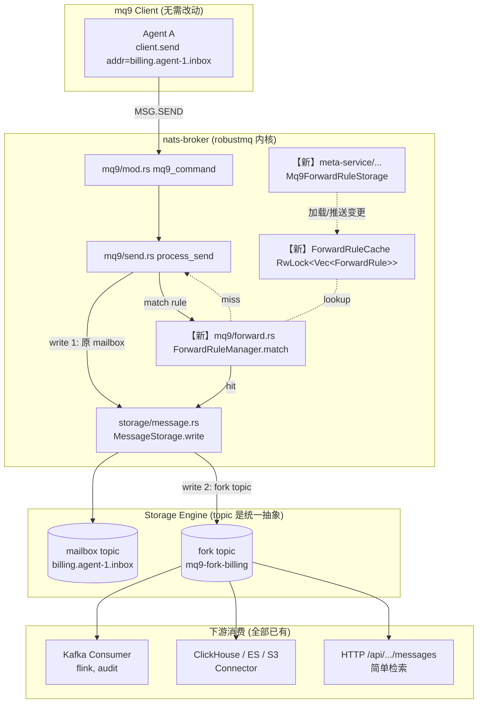

# mq9 消息分流（Message Fork）设计文档

> **背景**：将「Agent 之间的消息」按规则同步写入指定 topic，供 Kafka/Flink/审计/检索等下游系统消费。
>
> **关键事实**：RobustMQ 内核已具备「Connector + ETL 规则引擎」，能从一个 topic 读出并送到 17 种外部系统。本需求 **不需要新写 sink**，只需在 mq9 写入路径上加一个「分流到第二个 topic」的能力。
>
> **改动范围**：内核 `robustmq` 新增 ~600 行；mq9 client SDK **无需改动**。

---

## 1. 需求拆解

截图原文：

> 允许配置规则，将某些指定前缀的 agent 消息，全部写入某个 topic：
> - 用户可以用 kafka 等协议去直接消费（快速集成内部 flink 等大数据，安全审计系统）
> - 用户也可以直接查询这里面的消息（简单检索引擎）

拆成三个能力：

| 能力 | 含义 | 难度 |
|------|------|------|
| **R1 规则匹配** | 按 `mail_address` 前缀（以及 tags / priority / sender 等）筛选消息 | 新写 |
| **R2 分流落盘** | 把匹配到的消息**复制**一份到指定 topic（mailbox 那一份保持不动） | 新写 |
| **R3 下游消费 / 查询** | 用 Kafka 协议消费 / HTTP 查询那个 topic | **已有，无需开发** |

R3 之所以是 0 代码：RobustMQ 是多协议内核，同一个 topic 可以被 mq9 fetch、被 Kafka consumer、被 ClickHouse/ES/S3 connector 同时消费。这是这个需求能小改动落地的根本原因。

---

## 2. 现状梳理（先看清楚已有的乐高积木）

### 2.1 mq9 写入路径

发送链路：

```
mq9 client.send(addr, payload)
   │
   ▼  NATS request:  $mq9.AI.MSG.SEND.<addr>
nats-broker/src/mq9/mod.rs            mq9_command()  ─ 入口分发
   │
   ▼
nats-broker/src/mq9/send.rs           process_send() ─ 解析 headers、组装 AdapterWriteRecord
   │
   ▼
nats-broker/src/storage/message.rs    MessageStorage.write(tenant, mail_address, [record])
   │
   ▼
storage-adapter (持久化层)
```

参考代码：

- 入口分发：[src/nats-broker/src/mq9/mod.rs](robustmq/src/nats-broker/src/mq9/mod.rs#L24-L37)
- 当前写入实现：[src/nats-broker/src/mq9/send.rs](robustmq/src/nats-broker/src/mq9/send.rs#L108-L200)
- 存储抽象：[src/nats-broker/src/storage/message.rs](robustmq/src/nats-broker/src/storage/message.rs#L25-L48)

`process_send()` 内已经做完了：headers 解析、tag 拼接、TTL/delay/key 处理、`AdapterWriteRecord` 构建。**这就是分流逻辑的最佳挂点** —— 在这一段 record 已经成形、但还没 commit 之前接住。

### 2.2 现有 ETL 规则引擎

[`crates/rule-engine`](robustmq/src/rule-engine/src/lib.rs#L34) 提供的是 **payload transform**：

```rust
pub async fn apply_rule_engine(etl_rule: &ETLRule, data: &Bytes) -> Result<Bytes, CommonError>;
```

操作算子：`Decode / Extract / Rename / KeepOnly / Set / Delete / Encode`（[src/rule-engine/src/operator/](robustmq/src/rule-engine/src/operator/mod.rs)）。

⚠️ **能力差距**：这个引擎只解决「数据怎么变形」，不解决「数据要不要 / 要送到哪里」。本需求需要 **routing rule**（前缀匹配 + 目的 topic），是它的兄弟模块，不是替代。

### 2.3 现有 Connector 链路（下游消费的基础设施）

[`src/connector`](robustmq/src/connector/) 已经实现了从一个 topic 把数据搬到外部系统：

- 通用循环：[src/connector/src/loops.rs](robustmq/src/connector/src/loops.rs#L75-L160) `run_connector_loop()` —— `GroupConsumer` 读 topic → 调 sink.send_batch → 写下游
- 17 种 sink：[src/connector/src/](robustmq/src/connector/src/) `kafka / mqtt_bridge / elasticsearch / clickhouse / postgres / mysql / redis / s3 / webhook / pulsar / rabbitmq / mongodb / cassandra / opentsdb / influxdb / greptimedb / file`
- Connector 元数据：[src/common/metadata-struct/src/connector/mod.rs](robustmq/src/common/metadata-struct/src/connector/mod.rs#L43-L54) `MQTTConnector { topic_name, etl_rule, ... }`
- Admin API：[src/admin-server/src/cluster/connector.rs](robustmq/src/admin-server/src/cluster/connector.rs#L321) `connector_create()` + `/cluster/connector/create`

🎯 **结论**：只要 mq9 分流写出的 topic 是 RobustMQ 普通 storage topic，**用户配置一个 `topic_name = mq9-fork-billing` 的 Kafka Connector 就直接生效**，不用碰一行 connector 代码。

---

## 3. 设计方案

### 3.1 总体架构



### 3.2 核心数据结构

新增 `Mq9ForwardRule`（独立于 `MQTTConnector` 与 `ETLRule`，只管 **路由**）：

```rust
// src/common/metadata-struct/src/mq9/forward_rule.rs (新文件)

#[derive(Serialize, Deserialize, Default, Clone, Debug, PartialEq)]
pub struct Mq9ForwardRule {
    pub tenant: String,
    pub rule_name: String,                 // 唯一 ID
    pub matcher: Mq9ForwardMatcher,        // 匹配条件
    pub target: Mq9ForwardTarget,          // 目的地
    pub etl_rule: Option<ETLRule>,         // 可选: 复用现有 ETL 引擎做 payload 变形
    pub enabled: bool,
    pub create_time: u64,
    pub update_time: u64,
}

#[derive(Serialize, Deserialize, Default, Clone, Debug, PartialEq)]
pub struct Mq9ForwardMatcher {
    /// mail_address 前缀，例: ["billing.", "audit."]; 空 = 不限
    pub mail_address_prefixes: Vec<String>,
    /// tag 命中任意一个即算匹配；空 = 不限
    pub any_tags: Vec<String>,
    /// 优先级白名单；空 = 不限
    pub priorities: Vec<Priority>,
    /// 可选：sender (来自 reply_to 或 header) 前缀
    pub sender_prefixes: Vec<String>,
}

#[derive(Serialize, Deserialize, Default, Clone, Debug, PartialEq)]
pub struct Mq9ForwardTarget {
    /// 目的 topic 名（在同一个 storage-adapter 下）
    pub topic_name: String,
    /// 是否保留原 mq9 headers
    pub keep_headers: bool,
    /// fork 失败时的策略
    pub on_failure: ForkFailureStrategy,
}

#[derive(Serialize, Deserialize, Default, Clone, Debug, PartialEq)]
pub enum ForkFailureStrategy {
    /// 静默丢弃（默认；保证 mailbox 主路径不被拖累）
    #[default]
    DropAndLog,
    /// 整个 send 操作失败（强一致，慎用）
    FailSend,
}
```

> ✅ 为什么不复用 `MQTTConnector`：`MQTTConnector` 描述的是「topic → external」，本需求描述的是「mq9 消息 → 内部 topic」。语义上是 **入口侧规则**，与 `ETLRule` 的 transform 算子是正交的。两个概念硬塞一起会让 API 与 admin 视图混乱。

### 3.3 关键代码改动清单

按文件给出，标注 ➕ 新增 / ✏️ 修改 / ⬆️ 路由注册。

| 路径 | 改动 | 说明 |
|------|------|------|
| `src/common/metadata-struct/src/mq9/forward_rule.rs` | ➕ | 数据结构（见 3.2） |
| `src/nats-broker/src/mq9/forward.rs` | ➕ | `ForwardRuleManager`、`match_rules()`、`fork_record()` |
| `src/nats-broker/src/core/cache.rs` | ✏️ | `NatsCacheManager` 加 `forward_rules: DashMap<tenant, Vec<Mq9ForwardRule>>`，参考已有 mail/tenant 缓存 |
| `src/nats-broker/src/mq9/send.rs` | ✏️ | `process_send()` 末尾插入 fork 调用（详见 3.4） |
| `src/nats-broker/src/mq9/mod.rs` | ✏️ | `pub mod forward;` |
| `src/meta-service/src/storage/mq9/forward_rule.rs` | ➕ | RocksDB CRUD，照抄 `mqtt/connector.rs` 模式（[参考](robustmq/src/meta-service/src/storage/mqtt/connector.rs#L30-L80)） |
| `src/admin-server/src/cluster/mq9_forward.rs` | ➕ | HTTP handler: list/create/update/delete/toggle |
| `src/admin-server/src/server.rs` | ⬆️ | 注册 5 个新路由 |
| `src/admin-server/src/path.rs` | ✏️ | 5 个 path 常量 |
| `src/admin-server/src/client.rs` | ✏️ | 给 robust-ctl 用的 client 方法 |
| `src/cli-command/src/...` | ✏️ | `robust-ctl mq9 forward-rule {create,list,...}` 子命令 |
| `src/nats-broker/src/handler/...` | ✏️ | 启动时从 meta-service 拉规则；订阅 meta 变更事件刷新缓存 |
| `src/common/metadata-struct/src/mq9/mod.rs` | ✏️ | `pub mod forward_rule;` |

**预计代码量**：~600 行 Rust（其中 400 行是 admin/meta CRUD 样板）。

### 3.4 `process_send()` 改动（核心 patch）

[当前实现](robustmq/src/nats-broker/src/mq9/send.rs#L188-L200) 末尾如下：

```rust
    let offsets = MessageStorage::new(ctx.storage_driver_manager.clone())
        .write(&tenant, mail_address, vec![record])
        .await?;

    let offset = offsets.into_iter().next().ok_or_else(|| { ... })?;
    Ok(MsgSendReply { error: String::new(), msg_id: offset as i64 })
}
```

改后：

```rust
    let offsets = MessageStorage::new(ctx.storage_driver_manager.clone())
        .write(&tenant, mail_address, vec![record.clone()])  // clone 给 fork 用
        .await?;

    let offset = offsets.into_iter().next().ok_or_else(|| { ... })?;

    // === 新增：消息分流 ===
    // 注意：必须在 mailbox 写入成功之后，避免 fork 成功但 mailbox 失败造成的鬼影消息。
    if let Some(rules) = ctx.cache_manager.match_forward_rules(
        &tenant, mail_address, &mq9_headers, &priority,
    ) {
        crate::mq9::forward::dispatch_fork(
            &ctx.forward_dispatcher,   // mpsc::Sender<ForkJob>，启动时初始化
            ForkJob {
                tenant: tenant.clone(),
                source_addr: mail_address.to_string(),
                source_offset: offset,
                record,
                rules,
            },
        );
    }

    Ok(MsgSendReply { error: String::new(), msg_id: offset as i64 })
}
```

🔑 **设计要点**：

1. **fork 走异步 channel，不阻塞主路径**。`dispatch_fork` 是 `try_send`，channel 满了就按 `on_failure` 决定 drop/fail。这保证 mailbox 主链路的延迟与吞吐不被下游写性能拖死。
2. **mailbox 写入永远先成功**。fork 只在主写入成功后才触发，避免「下游收到了，发送方却以为失败」。
3. `match_forward_rules` 是 **缓存内 O(规则数 × prefix) 的字符串比较**，规则少（< 100 条）时 < 1µs，规则多再加 Aho-Corasick / trie 优化。

### 3.5 后台 fork 任务

新文件 `src/nats-broker/src/mq9/forward.rs`：

```rust
pub struct ForkJob {
    pub tenant: String,
    pub source_addr: String,
    pub source_offset: u64,
    pub record: AdapterWriteRecord,
    pub rules: Vec<Mq9ForwardRule>,
}

pub fn spawn_fork_worker(
    storage: Arc<StorageDriverManager>,
    mut rx: mpsc::Receiver<ForkJob>,
) {
    tokio::spawn(async move {
        while let Some(job) = rx.recv().await {
            for rule in &job.rules {
                if let Err(e) = fork_one(&storage, &job, rule).await {
                    // metrics + log
                    record_fork_failure(&rule.rule_name);
                    warn!(
                        "fork rule={} from={} -> {}: {}",
                        rule.rule_name, job.source_addr, rule.target.topic_name, e
                    );
                    if matches!(rule.target.on_failure, ForkFailureStrategy::FailSend) {
                        // FailSend 走的是另一个同步通道，这里到不了
                    }
                }
            }
        }
    });
}

async fn fork_one(
    storage: &Arc<StorageDriverManager>,
    job: &ForkJob,
    rule: &Mq9ForwardRule,
) -> Result<(), NatsBrokerError> {
    // 1. payload 变形（可选）
    let payload = if let Some(etl) = &rule.etl_rule {
        apply_rule_engine(etl, &job.record.payload).await?
    } else {
        job.record.payload.clone()
    };

    // 2. 加溯源 tag，下游审计系统能追到原 mailbox
    let mut forked = job.record.clone();
    forked.payload = payload;
    forked.tags.push(format!("mq9-source/{}", job.source_addr));
    forked.tags.push(format!("mq9-source-offset/{}", job.source_offset));
    if !rule.target.keep_headers {
        if let Some(pd) = &mut forked.protocol_data {
            if let Some(mq9) = &mut pd.mq9 { mq9.header = None; }
        }
    }

    // 3. 写到 fork topic
    MessageStorage::new(storage.clone())
        .write(&job.tenant, &rule.target.topic_name, vec![forked])
        .await?;
    Ok(())
}
```

### 3.6 Admin API

复刻 connector 的样式：

```
POST   /mq9/forward-rule/create     -> 创建
POST   /mq9/forward-rule/update     -> 更新（含 enable/disable）
POST   /mq9/forward-rule/delete     -> 删除
GET    /mq9/forward-rule/list       -> 列表
GET    /mq9/forward-rule/detail     -> 详情
```

请求示例：

```jsonc
POST /mq9/forward-rule/create
{
  "tenant": "default",
  "rule_name": "billing-to-clickhouse",
  "matcher": {
    "mail_address_prefixes": ["billing."],
    "any_tags": ["audit"],
    "priorities": []
  },
  "target": {
    "topic_name": "mq9-fork-billing",
    "keep_headers": true,
    "on_failure": "DropAndLog"
  },
  "etl_rule": null,
  "enabled": true
}
```

`robust-ctl` 子命令：

```bash
robust-ctl mq9 forward-rule create --rule-name billing-to-clickhouse \
    --prefix billing. --tag audit --target mq9-fork-billing
robust-ctl mq9 forward-rule list
robust-ctl mq9 forward-rule disable billing-to-clickhouse
```

### 3.7 下游消费的两种方式（R3，零代码）

**A. 通过 Kafka 协议消费**（最常见，对接 Flink/Spark/安全审计）

```bash
# RobustMQ 的 kafka-broker 已经把所有 topic 透明暴露成 Kafka 协议
# fork topic 写完就能用任何 Kafka 客户端读
kafka-console-consumer --bootstrap-server localhost:9092 \
    --topic default-mq9-fork-billing --from-beginning
```

> Topic 命名建议：`<tenant>-<fork-topic-name>`，避免 tenant 串。这是 kafka-broker 已有的 [topic 路由约定](robustmq/src/kafka-broker/)。

**B. 通过 Connector 写到其他系统**（一次配置永久同步）

```bash
robust-ctl connector create --connector-name fork-to-clickhouse \
    --connector-type ClickHouse \
    --topic-name mq9-fork-billing \
    --config '{"url":"http://ch:8123","table":"agent_messages"}'
```

→ 这里就接上了 [connector 那一套已有的 17 种 sink](robustmq/src/connector/src/manager.rs#L20-L30)。

**C. 直接 HTTP 查询**（简单检索）

用现成的 `MSG.QUERY.<topic>`（或 admin-server 上新增一个 `GET /topics/{name}/messages?key=&since=&limit=`，3 行代码包一下 `process_query`）。

---

## 4. 不会做什么（架构约束）

| 反模式 | 为什么不做 |
|--------|----------|
| 把 fork 写在 `process_send` 同步路径里 | 拖累 mailbox 主路径延迟，下游一抖整个 broker 就慢 |
| 复用 `MQTTConnector` 结构表达 mq9 路由 | 语义混淆；admin UI 和权限会一团乱 |
| 在 mq9 client SDK 里加 fork 逻辑 | 客户端不可信、配置不集中、规则变更要发版 |
| 给每个 mq9 mailbox 都做一份冷备 fork | 浪费存储；按规则配置才符合「指定前缀」需求 |
| 自己写一个 ClickHouse/Kafka writer | RobustMQ 已经有 17 个 sink，重复造轮子 |
| 把 `apply_rule_engine` 改成支持 routing | 单一职责：transform 与 route 不要耦合 |

---

## 5. 兼容 / 演进 / 测试

### 兼容性

- 老 client、老 mailbox 行为 **完全不变**。规则表为空时 `match_forward_rules` 早 return None，热路径零开销。
- 没启用规则的部署，meta-service 不写新的 RocksDB 列族 key，升级回滚平滑。

### 可观测性（必加）

- `mq9_forward_match_total{rule,tenant}`
- `mq9_forward_write_success_total{rule}` / `mq9_forward_write_failure_total{rule,reason}`
- `mq9_forward_dispatch_lag_seconds`（fork channel 滞留时间，histogram）
- `mq9_forward_channel_full_drops_total` ← 这是 SRE 必须监控的，触发就要加 worker 或降配规则

### 测试

| 层 | 用例 |
|----|------|
| 单元 | `Mq9ForwardMatcher` 各匹配维度组合；ETL+routing 串联 |
| 集成 | `tests/mq9_forward.rs`：建规则 → send 命中前缀 → fetch 原 mailbox + fetch fork topic 各一条 |
| 集成 | send 未命中规则时 fork topic 上无任何写入 |
| 集成 | fork channel 满时 `DropAndLog` 与 `FailSend` 行为正确 |
| E2E | Kafka 客户端能消费到 fork topic 的消息（验证 R3-A） |
| E2E | 创建 ClickHouse connector 指向 fork topic，端到端落库（验证 R3-B） |
| 性能 | 1000 条规则全 miss 时 `process_send` p99 退化 < 5% |

---

## 6. 落地路径（建议拆 4 个 PR）

| PR | 内容 | 风险 | 行数 |
|----|------|------|------|
| 1 | `Mq9ForwardRule` 数据结构 + meta-service RocksDB CRUD + cache | 低 | ~200 |
| 2 | `process_send` 集成 + `forward.rs` worker + metrics | 中（热路径） | ~250 |
| 3 | Admin HTTP API + `robust-ctl` 子命令 | 低 | ~150 |
| 4 | 集成测试 + E2E 用例 + 文档 | 低 | ~200 |

PR 顺序不能颠倒：1 是结构地基，2 才是业务，3/4 可以并行。

---

## 7. mq9 客户端如何使用（无需改 SDK，只是给用户的指南）

Agent 端代码不变：

```java
// Agent A —— 发送侧完全无感
client.send("billing.agent-1.inbox", payload, SendOptions.builder()
    .tags(List.of("audit", "invoice"))
    .priority(Priority.URGENT)
    .build());
```

管理员一次性配置：

```bash
# 1) 配置分流规则：billing.* 前缀且带 audit tag 的消息复制到 mq9-fork-billing
robust-ctl mq9 forward-rule create --rule-name audit \
    --prefix billing. --tag audit --target mq9-fork-billing

# 2) 把 fork topic 接到 ClickHouse 长期留存
robust-ctl connector create --connector-name audit-ch \
    --connector-type ClickHouse --topic-name mq9-fork-billing \
    --config '{"url":"http://ch:8123","table":"agent_messages"}'

# 3) Flink 直接当 Kafka topic 消费 (用 RobustMQ kafka-broker 协议)
flink-sql> CREATE TABLE audit_stream (...) WITH (
  'connector' = 'kafka',
  'topic'     = 'default-mq9-fork-billing',
  'properties.bootstrap.servers' = 'robustmq:9092',
  ...
);
```

> **这就是这个设计最值钱的地方**：所有「下游怎么用」的问题都被 RobustMQ 已有的多协议能力消化掉了；mq9 这边只增加了一个非常薄的「写双份」开关。

---

## 8. TL;DR

- 新增一个 **mq9 端 routing rule**（前缀 + tags + priority → 目的 topic）；
- 在 `process_send` 主写入成功后，**通过异步 channel** 再写一份到 fork topic；
- fork topic 是普通 storage topic，**直接被 RobustMQ 已有的 Kafka 协议层和 17 种 connector 复用**；
- mq9 client SDK **零改动**；
- 内核新增约 600 行 Rust，分 4 个 PR 落地。
